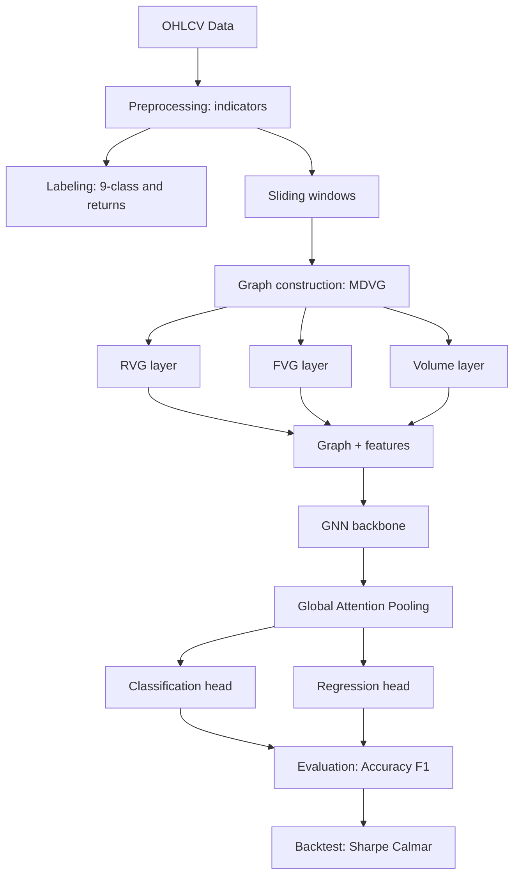

## Framework Overview

This repository implements the **Multiplex Directional Visibility Graph (MDVG)** framework for financial time series forecasting.
It extends traditional **Rising Visibility Graphs (RVG)** by adding:

- **RVG layer** – edges formed during upward price visibility,
- **FVG layer** – edges formed during downward price visibility,
- **Volume layer** – local edges weighted by trading activity (e.g., OBV, z-scored volume).

Each graph window integrates **price dynamics + volume conviction**, producing richer structures for GNN models.

---

## Workflow

1. **Preprocessing**

   - Load OHLCV data.
   - Compute rolling indicators: returns, RSI, ATR, candle body/wicks, volume z-score, OBV.
   - Create labels:

     - **9-class patterns** (UP/FLAT/DOWN × horizons).
     - **Forward return regression**.

2. **Graph Construction**

   - Slice data into sliding windows.
   - Build MDVG with RVG, FVG, and Volume edges.
   - Add **node features** (returns, RSI, ATR, body/wick, vol_z, OBV) and **edge features** (slope, time gap, cum_return, vol_avg, OBV delta, weight).

3. **GNN Modeling**

   - **Edge-aware GNNs** (ECC/NNConv, GatedGCN) process the graph with edge attributes.
   - **Readout**: Global Attention Pooling → graph embedding.
   - **Heads**:

     - Classification (9-class trend patterns).
     - Regression (forward returns).

4. **Training & Evaluation**

   - Multi-task loss = CrossEntropy + λ·MSE.
   - Validation on both ML metrics (Accuracy, F1) and Finance metrics (Sharpe, Calmar).
   - Ablation runs:

     - RVG only vs RVG+FVG vs Full MDVG.
     - With vs without Volume edges.
     - Edge-aware vs edge-agnostic GNN.

---

## Why use this?

- Adds **directionality + volume awareness** to visibility graphs.
- Modular: swap GNN backbones (ECC, GIN, GAT, etc.).
- End-to-end pipeline: OHLCV → Graph → GNN → Predictions → Backtest.
- Easy to extend with new features, horizons, or readout layers.

---
